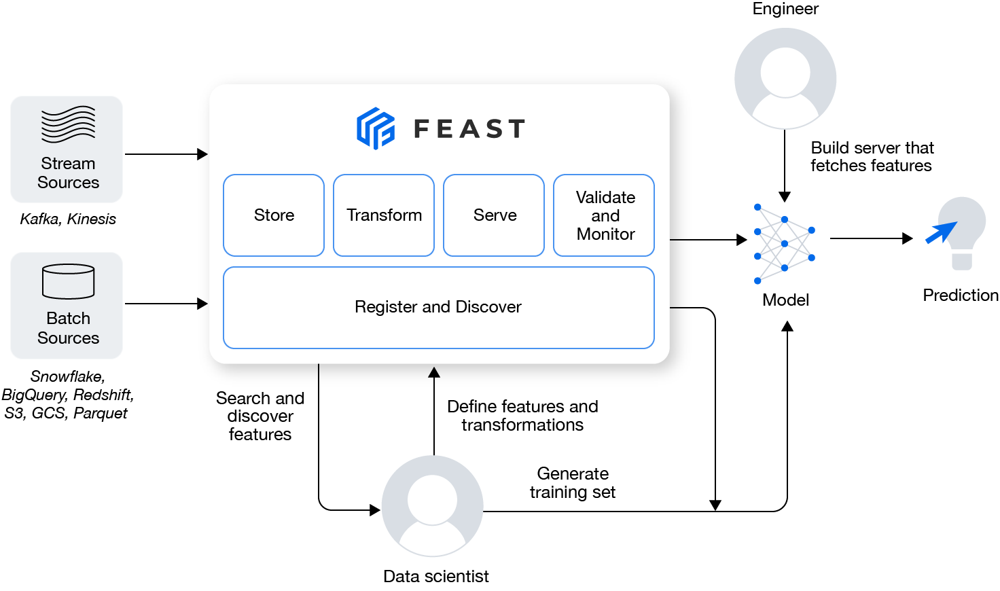

:link: 출처 : <a href="https://docs.feast.dev/">docs.feast.dev</a>

# What is Feast?

Feast는 Feature Store의 준말로

1. 기존 Train Data의 보관
2. 새로운 Stream Data의 실시간 처리 및 저장
3. 기존 Train Data를 결합 및 가공하여 재사용
4. etc.

를 제공하는 오픈소스 프레임워크입니다. 현재 stable(1.0.0) 버전은 없습니다. 그들이 정해놓은 <a href="https://docs.feast.dev/roadmap">Roadmap</a>을 기준으로 개발중이며 2022년 8월 5일 기준 <a href="https://github.com/feast-dev/feast/tree/v0.23-branch">0.23-branch</a>가 배포되었습니다.

## 모델 학습 및 배포에 이용할 데이터를 일관성있게 제공

- Online-store: 기존 학습데이터와 축적된 데이터를 저장하는 저장소.
- Offline-store: 모델에 입력으로 넣을 데이터를 짧은 시간동안 갖고 있는 저장소.
  - 저는 데이터 큐처럼 설계하여 이용하고 있습니다.
- Feature Sever: 데이터 가공을 거치기위해 구축되어있는 서버

## 데이터 누유(leak)를 방지

- 데이터에 대한 디버깅을 제공하여 잘못된 데이터 세트 결합을 방지
  - 훈련에 사용될 데이터만 가져올 수 있게 됩니다. (잘못되게 섞이지 않는다는거죠.)

## ML 데이터 구조를 분리

- ML모델과 데이터파이프라인을 분리합니다.
  - 학습모델 :arrow_right: 배포모델
  - 오프라인스토어 :arrow_right: 온라인스토어
  - Feast :arrow_right: 다른 시스템
- ML engineer와 Data Scientist의 영역을 구분합니다.
  - Off-Line Store(Data Scientist)
    - Batch Data :arrow_right: Train Data 로 사용합니다.
    - 파생변수에 대한 연구가 이뤄집니다. 이를 Feast에 Apply합니다.
  - On-Line Store(ML Engineer, MLOps)
    - Streaming Data를 위한 파이프라인 구현
    - 모델을 추출하여 배포하여 On-Line Store의 데이터가 입력될 곳도 만들죠.

# Feast의 타겟 사용자는 누구일까요?

> 
>
> *"DevOps + ML = MLOps 를 통해 실시간 데이터를 생산할 수 있도록 지원합니다."*
>
> 

## Feast에서 정의하기를 이럴때 쓰지말래요

- ML을 사용한 비즈니스가 정의되지 않았다.
- 주로 비정형 데이터(이미지, 음성, 영상)을 다루는 조직
- 매우 짧은 시간에 Feature 탐색을 완료해야 한다. ( << 10ms )
- 다양한 케이스를 지원하는 소규모 팀

## Feast는 그럼 누가 써야할까요?

제 개인적인 생각으로는

1. ML 비즈니스 모델이 정의 되었다.
2. Table Data를 다룬다.
   1. 시간에 영향을 받는다.(시계열 데이터)
   2. 그 중에 실시간 데이터 파이프라인 배포가 필요하다.
3. 데이터 전처리 규칙이 정해지면, 꽤 오랜기간 변화가 없는 팀.
4. 데이터 사이언티스트가 존재하고 데이터에 대한 지속적인 연구를 하고싶은 팀.

> Feast는 회사에서 적극적으로 도입하고 있는 중이고, 지속적인 공부를 할 생각입니다.
>
> 다음 포스팅도 봐주시기 바랍니다.
>
> 포스팅에 대한 피드백은 언제든지 환영입니다!