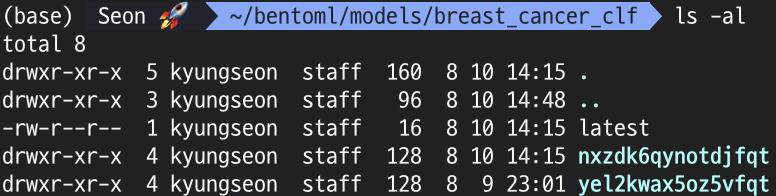
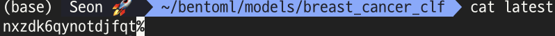

# 1. 이글의 목적

🔗  <a href="https://docs.bentoml.org/en/latest/frameworks/xgboost.html">https://docs.bentoml.org/en/latest/frameworks/xgboost.html</a>

튜토리얼도 굉장히 쉽게 구성되어 있어서...이 글이 필요할까 싶어요.

그래도 나도 정리할겸. 내가 다뤄본 경험도 넣을겸. 써볼까합니다.

튜토리얼로도 충분히 이해가 될만한 수준이라면 보지마요 부끄러워요.

sklearn에서 제공하는 <a href="https://scikit-learn.org/stable/modules/generated/sklearn.datasets.load_breast_cancer.html#sklearn.datasets.load_breast_cancer">breast_cancer</a>를 이용하여 Batch Prediction(여러 Row를 한방에 예측해줭.)을 제공하는 API를 만들어 볼거에요.


# 2. BentoML 설치

2022년 8월 9일 기준 1.0.3 버전이 배포되어있습니다.

```shell
pip install --upgrade pip
pip install bentoml
```

로 설치해봅시다.


# 3. 모델 학습하기

xgboost로 심장병(Breast Cancer) 이진분류모델(Binary Classification Model) 생성하기

```python
# BentoML 가져와
import bentoml

from xgboost as xgb
# Toy Dataset 가져와
from sklearn import datasets

# Breast Cancer 데이터셋 가져오기.
breast_cancer = datasets.load_breast_cancer()
X, y = breast_cancer.data, breast_cancer.target
```

```python
# 학습된 xgb 모델 만들기.
xgb_clf = xgb.DMatrix(X, label=y)
param = {"max_depth": 3, "eta": 0.3, "objective": "multi:softprob", "num_class": 2}
fitted_clf = xgb.train(param, xgb_clf)
```

```python
# BentoML(XGBoost) 저장하기
saved_model = bentoml.xgboost.save_model('breast_cancer_clf', fitted_clf)
print(f'Model saved: {saved_model}')

"""
OutPut:
Model saved: Model(tag="breast_cancer_clf:nxzdk6qynotdjfqt")
"""
```

저장된 모델들은 어디에 있나? 기본 저장경로는 ~/bnetoml 하위 폴더로 저장됩니다.



이렇게 **~/bentoml/models/${model_name}**에 폴더(태그명)로서 버전관리가 되며 저장됩니다.



latest파일에는 태그명이 저장되어 latest의 태그명(labels)[^1]을 관리하고있습니다. 그래서 latest 태그로 최신 모델을 불러올 수 있습니다.

```python
# 저장되어있는 최신버전 모델 가져오기
bento_model = bentoml.xgboost.load_model("breast_cancer_clf:latest")
```


TBA

[^1]: docker에서는 태그(tag), BentoML에서는 Labels로 표현한다. 
