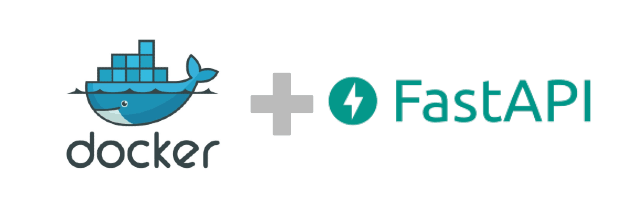

# What is BentoML?

🔗 <a href="https://docs.bentoml.org/en/latest/index.html">https://docs.bentoml.org/en/latest/index.html</a>

BentoML은 ML모델을 제공하기 위한 오픈소스 프레임워크입니다.

- ML모델을 제품화하는것을 가속화합니다.
- ML모델을 프로덕션하는것을 표준화할 수 있게 합니다.
- 안정적이고 확장 가능한 고성능 모델을 제공할 수 있게 합니다.
- 유연한 MLOps 플랫폼을 제공합니다.

## 간단한 정의

> ***BentoML = ML+ FastAPI + Docker 입니다. 🍱***

우리가 생각할 수 있는 모델(ML/DL)을 컨테이너화(Docerize) 합니다. 근데 FastAPI로 Back-end End-point를 곁들인.

### Docker가 있어서 BentoML이 갖는 장점

- Docker Daemon이 있으면 어디서든 Server로서 운용할 수 있다.
- BentoML의 배포가 빨라지고 쉽게 표준화 할 수 있다.
- 같은 모델을 여러개 띄워 확장성을 쉽게 넓힐 수 있다. (like Scale-Out)
- 리소스 사용량 체크가 쉬움.

### FastAPI가 있어서 BentoML이 갖는 장점

- 쉬운 API 추가
- 쉬운 API 사용
- 쉬운 마이그레이션
- 쉬운 보안 적용
- Customize가 쉬워짐.
