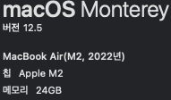
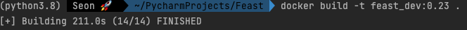
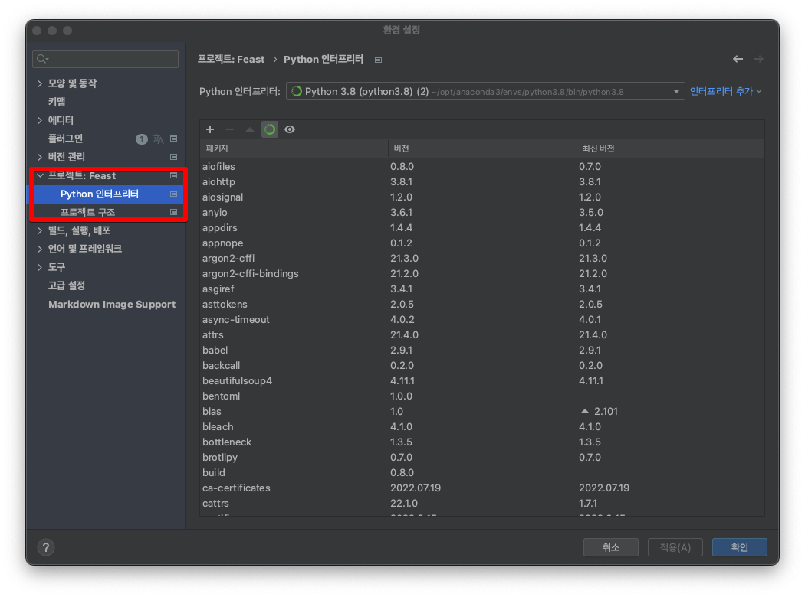
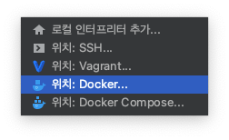
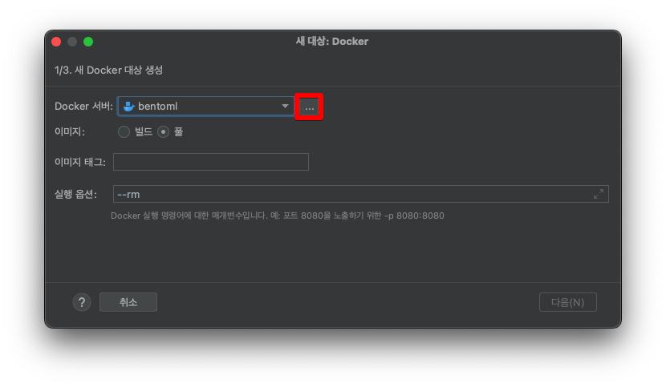
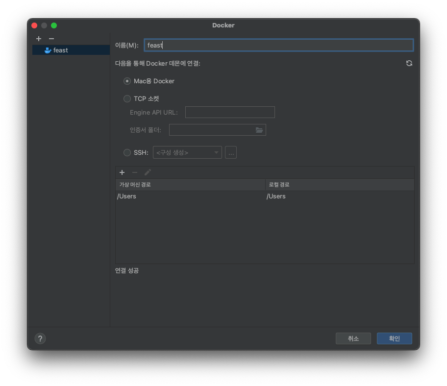
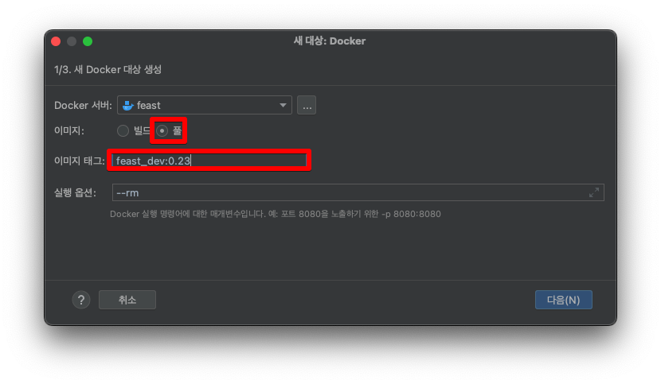
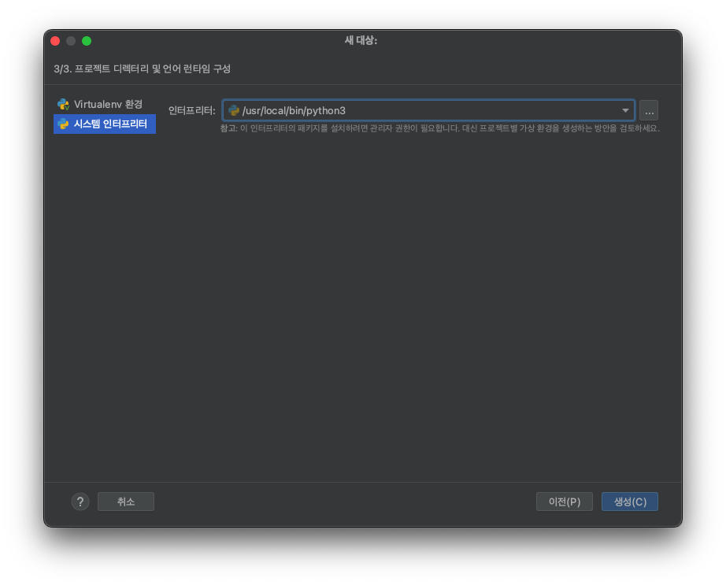
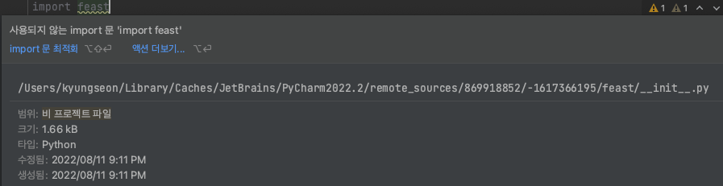

# 1. Apple Silicon M2에서 Feast 개발하기

내 Macbook Air M2로....Feast를 개발하고싶은데 어떤 수를 써도 해결방법을 찾지 못했다. 근데 Docker로 개발환경을 구성해서 한다면 어떨까? 라는 생각을 하게됐고 이 생각의 근원은 **직장동료**가 알려줬다...

우선 나는 Pycharm을 IDE로 쓰고 있고, 다른 IDE도 비슷하겠지만 Docker로 환경을 구성하려면 매번 Dockerfile을 빌드해서 쓰거나 이미지를 사용할 수 있다. 당연히 후자가 덜 귀찮을 것 같아서 후자로 만들어 볼 것이다.


## 개발환경

Device: Macbook Air M2

OS: macOS Monterey v12.5

CPU: M2



RAM: 24gb로 산 흑우 음머.


# 2. Docker Image 만들기

Dockerfile, requirements 등 기초 설정 과정입니다.


## Dockerfile

```dockerfile
# Base Image
FROM openjdk:8u332-slim-bullseye
COPY --from=python:3.8.13-slim-bullseye / /
# mkdir error solution
RUN groupadd feast
RUN mkdir -p /.cache
RUN chmod 770 /.cache
RUN chown root:feast /.cache
# copy requirements
COPY requirements-feast.txt /tmp/requirements.txt
# install package
RUN pip install -r /tmp/requirements.txt
```


## requirements-feast.txt

```python
feast[redis]==0.23
oyaml==1.0
fastapi==0.78.0
uvicorn==0.17.6
uvicorn[standard]
pyspark==3.3
requests==2.28.1
pandas==1.4.3
pydantic==1.9.1
pyarrow==6.0.1
python-multipart==0.0.5
gunicorn==20.1.0
```


## docker build

이제 이미지 빌드해줘야죠.

```shell
# docker build: build 명령어
# -t: tag명 설정하는 옵션
# feast_dev:0.23: docker image name:version_tag
# .: Dockerfile이 있는 경로

docker build -t feast_dev:0.23 .
```

저는 211초 정도 걸렸네요....




# 3. PyCharm에서 환경 설정하기

환경설정(Preference)를 열어줍니다.


## 인터프리터, 가상환경 설정해주기



프로젝트:${프로젝트명} 탭을 눌러 python 인터프리터를 눌러줍니다.

인터프리터 추가를 눌러줍니다.



그럼 이렇게 뜨는데, Docker를 눌러줍니다.





+눌러서 새로 만들어주고 저는 이름을 feast로 했어요.



그냥 다음, 다음 누르세요.



시스템 인터프리터 설정하고 생성하기.

그럼 이제 인터프리터 업데이트만 기다리면 됩니다.


너무 행복해....뻘짓했던거 생각하면..


## import feast



행복합니다....


