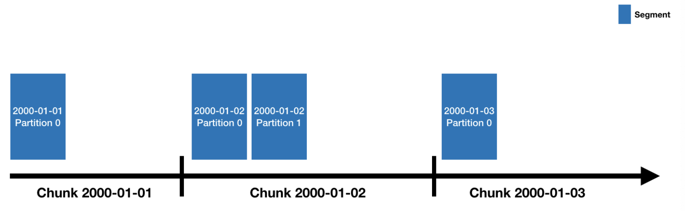

# Druid 소개

> OLAP을 위해 설계된 실시간 데이터 분석용 데이터베이스.

- 클릭스트림 분석
- 네트워크 성능 모니터링을 포함한 네트워크 분석
- 서버 메트릭 저장소
- 애플리케이션 성능 메트릭 저장소
- 제조 데이터 메트릭 저장소
- OLAP
- etc.

"실시간으로 데이터를 만지고 조회할 수 있는게 필요해!" 라면 다 적용 가능 하다는 내용인 것 같습니다. IoT같이 작은 데이터가 실시간으로 무수히 쌓이는 환경이라면 최적이라는 생각입니다.

## Druid 특징

1. 열 저장 형식(Columar DB)
   - 열 조회 쿼리 속도가 크게 향상됩니다.
2. 확장 가능한 분산 시스템
   - Druid는 수십애에서 수백대까지 클러스터링 할 수 있습니다.
   - 요건에 따라서 클러스터 노드 개수를 조정하면 됩니다.
3. 대규모 병렬 처리
4. 실시간 또는 일괄 수집
   - Batch Ingestion(일괄 수집)과 Streaming Ingestion(실시간 수집)을 지원합니다.
5. 장애 회복이 빠르며, 다운타임이 없습니다.
6. 데이터 손실이 없는 클라우드 네이티브도 제공합니다.
   - 딥스토리지로 클라우드로 설정할 수 있습니다.
7. 시간 기반 파티셔닝
   - 초, 분, 시, 일 등 시간을 기반으로 데이터를 구획(파티셔닝)할 수 있습니다.
   - **시계열 데이터만 취급하는 것은 도메인에 따라 단점일 수 있습니다.**
8. 수집 시 자동 요약
   - RollUp 기능을 통해 데이터 수집과 함께 통계 데이터를 산출 할 수 있습니다.
   - 이는 커스터마이징 가능합니다.

## 딥스토리지

- 딥스토리지를 통해 데이터의 무손실을 제공합니다.
- Cloud로는 AWS, GCP, Azure와 같은 클라우드 3사를 지원합니다.
- Native로는 json, csv, tsp, parquet 등 다양한 파일 형식을 지원합니다.
- 딥스토리지로부터 가져온 데이터를 세그먼트라는 파일에 저장합니다.

## Druid의 구조(Service of Druid)

- Coordinator: 클러스터의 데이터 가용성을 관리
- Overload: 데이터 수집에 필요한 리소스 할당을 제어
- Broker: 외부로부터 들어오는 쿼리들을 관리
- Router: 외부 요청을 brokers, coordinators, overloads로 라우팅 (optional)
- Historical: 쿼리 가능한 데이터들을 저장함 (아마도 한번 쿼리했던 데이터들을 저장해서 속도를 높이는 것으로 추정)
- MiddleManager: 데이터를 삽입

## 메타데이터 저장

- 드루이드의 메타데이터는 PostgreSQL 또는 MySQL과 같은 RDB를 이용하여 저장합니다.

## Druid의 데이터 저장(Segment)

- 데이터 소스로부터 시간을 기준으로 분할하여 저장합니다.
- 년, 월, 일, 시, 분, 초 등의 기준으로 파티셔닝 할 수 있으며 파티셔닝 된 데이터 덩어리를 세스먼트라고 합니다.
- Druid가 잘 동작하려면 세그먼트 파일크기가 300~700MB사이여야 하며 partitionSpec 조정을 통해 데이터를 잘 분할하여야 합니다.

# 공식 홈페이지

🔗<a href="https://druid.apache.org/docs/latest/design/index.html">https://druid.apache.org/docs/latest/design/index.html</a>

